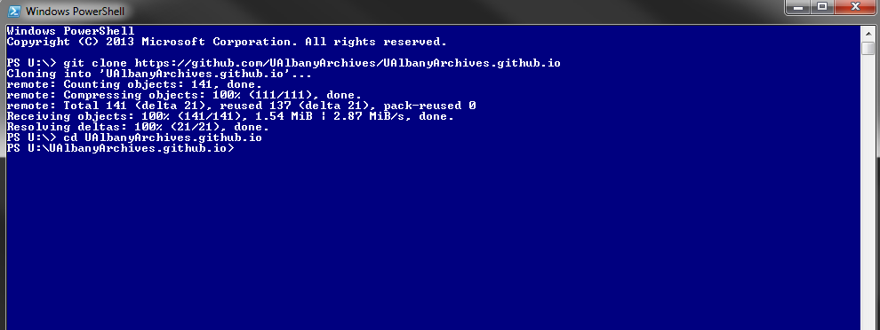
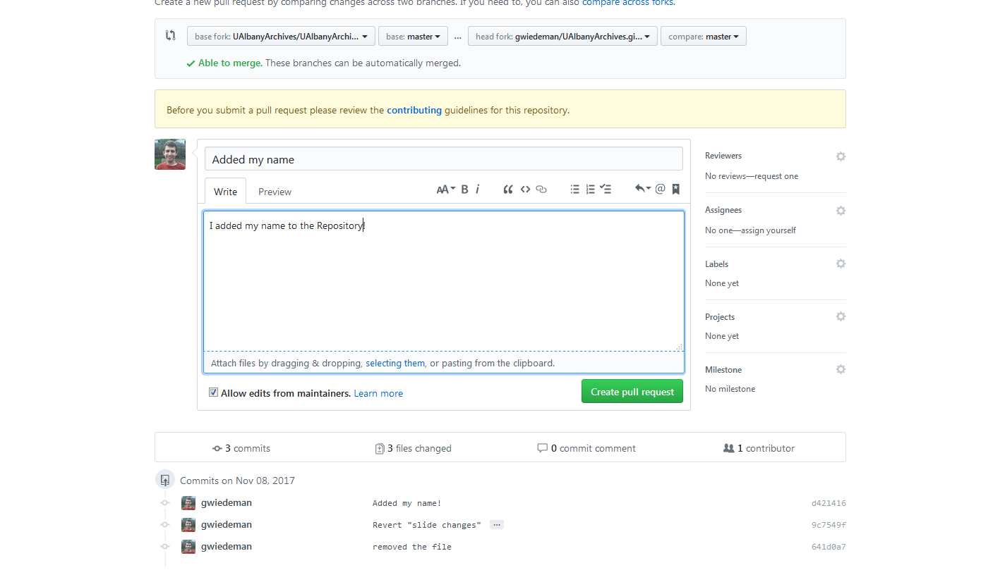

## Git and GitHub for Libraries

Greg Wiedeman and Mark Wolfe 
M.E. Grenander Dept. of Special Collections & Archives 
University at Albany, SUNY

[https://ualbanyarchives.github.io](https://ualbanyarchives.github.io/)

---

## What You Will Learn/Do
**- Part 1**

- Fundamentals about Git & GitHub
- Why Librarians Should Care
- Overview of Version Control
- Basic terminology and commands
- Library run GitHub accounts

---

## What You Will Learn/Do
**- Part 2**

- Set up a GitHub account
- Install GUI version of Git
- How to contribute to existing GitHub project
- Applications to the Library field
- How to share code

  
---

## Background about Git
- Git most widely used version control system in the world
- Created by Linus Torvalds in 2005 (creator of Linux)
- Git is free and open source
- GitHub Founded in 2008
- Wide use in software community
- Git the soft and heart of GitHub 
​
---
## Background about GitHub
- Git is free and open source
- Founded in 2008
- Wide use in software community
- Tends to be homes for open source projects
- GitHub fosters open sharing 
- Free for public use, fee for private
- Work distributively

 ​
---
## Why Should I Learn Git and GitHub?
- Fosters complex collaboration projects
- Metadata or cataloging
- Administrative documents
- Archival finding aid collections
- Supports digital scholarly
	- statistical code, text mining 
- Collaborative writing/editing
	- more elegant than "track changes" 

---

## Version Control at a Glance
- Used to manage changes to documents, code, large websites
- Systematizes updates or "versioning"
- Allows to "roll back" any change to a previous version
- No more files named "version 1" "version_1_mark_edits"
- Allows for testing	
	- New feature on website gets tested

---

## Terminology a Glance Part 1
- Create repositories or "repos"
	- website, code, documents, etc
- Users can "clone" or download that repo
- Add files to a staging area
- Commit files to the repo
- Push changes to the repo
- Repo owners can invite 

	
---

## Terminology a Glance Part 2
- "repos" can be "branched" or "forked"
- Branching allows repos to be worked on simultaneously 
	- Once changes are agreed on, the branch can be "merged"
- If repo diverges enough, it is forked into a new repo  
	
---

## Examples of Git Repositories by Librarians

* Librarians
	* https://github.com/infogrrl
	* https://github.com/saverkamp
	* https://github.com/anarchivist
	* https://github.com/rgilmour70
	*
* Libraries & Archives
	* https://github.com/RockefellerArchiveCenter

---

## Stuff to Do

* Make a [Github Account](https://github.com/login)
* Download and install [Git](https://git-scm.com/) or [Github Desktop](https://desktop.github.com//)
* Download and install markdown editor (optional)
	* [Typora](https://typora.io/)
	* [Atom](https://atom.io/)
	* [Markdown Pad](http://markdownpad.com/) (Windows)
	* [Mou](http://25.io/mou/) (Mac/Linux)
	* [MacDown](https://macdown.uranusjr.com/) (Mac/Linux)

---

## How these slides work

### GUI Path

Down arrow for CLI path

----

### CLI Path

---

1. [Create a Github Account](https://github.com/join?source=login) or [Login](https://github.com/login) to your existing account.

---

2. [Create a new git repository](https://github.com/new)

---

3. Enter USERNAME.github.io

---

4. This is your Github Repository

---

### GUI Path

5. [Download and Install Github Desktop](https://desktop.github.com//)

----

### CLI Path

5. [Download and Install Git](https://git-scm.com/)

----

### CLI Path

5. Tell Git who you are

		git config --global user.email "you@example.com"
		git config --global user.name "Your Name"

---

### GUI Path

6. Clone your repo

----

### CLI Path

6. Clone your repo

* Open Terminal, Powershell or cmd.exe

		git clone http://github.com/USERNAME.github.io

* Change directory into your repo

		cd USERNAME.github.io

---

### GUI Path

7. Open your repo

----

### CLI Path

7. Open your repo

* Windows:

		start .

* Mac OSX/Linux:

		open .

---

8. Look at your repo

---

9. (Optional) Install a Markdown Editor

* Cross Platform:
	* [Atom](https://atom.io/)
	* [Typora](https://typora.io/)

* Windows:
	* [MarkdownPad 2](http://markdownpad.com/)

* Mac OSX/Linux
	* [Mou](http://25.io/mou/)
	* [MacDown](https://macdown.uranusjr.com/)

---

10. Edit README.md ([Markdown CheatSheet](https://github.com/adam-p/markdown-here/wiki/Markdown-Cheatsheet))

---

### GUI Path

11. See the Changes

----

### CLI Path

11. See the Changes

		git status
		git diff

---

### GUI Path

12. Add, Commit, Push

----

### CLI Path

12. Add, Commit, Push

		git add .
		git commit -m "Updated Readme!"
		git push origin master

---

13. Take a look at your commit!

---

14. Make a bad edit

---

### GUI Path

15. Commit your mistake

----

### CLI Path

15. Commit your mistake

		git add .
		git commit -m "this is a mistake"
		git push origin master

---

### GUI Path

16. Revert!

----

### CLI Path

16. Revert!

		git revert commitID
		:quit
		git push origin master

---

## Collaboration

---

## Collaboration Concepts

* Pull Request
	* A suggested change
* Branch
	* A separate version of a repo
* Merge
	* Combining a "branch" with the "master" 
* Fork
	* Your personal copy of a repo
	* For pull requests when you are not a collaborator

---

### GUI Path

17. Checkout a Branch

----

### CLI Path

17. Checkout a Branch

		git checkout -b testing
		git add .
		git commit -m "the changes to my branch"
		git push origin testing

---

### GUI Path

18. Merge with master

----

### CLI Path

18. Merge with master

		git checkout master
		git merge testing
		git push origin master

---

19. Fork the [Repo](https://github.com/UAlbanyArchives/UAlbanyArchives.github.io)!

---

### GUI Path

19. Clone the fork!

----

### CLI Path

19. Clone the fork!

		git clone [URL]
		cd [repo name]

---

### GUI Path

20. Add a new file with your name in it and commit! 

(don't forget to push!)

----

### CLI Path

20. Add a new file with your name in it and commit! 

		git add .
		git commit -m "Added my name!"
		git push origin master

---

21. Make a Pull Request!

---

## Use Case: Collecting Policy

* [UAlbany Archives Collection Development Policy](http://library.albany.edu/archive/policy)
* [Rockefeller Archive Center Digital Team Values](https://github.com/RockefellerArchiveCenter/dteamValues/blob/master/values.md)
* [DACS Content Standard](https://github.com/saa-ts-dacs/dacs)

---

## Use Case: Collecting Policy

* Converting markdown with [pandoc](https://pandoc.org/)

		pandoc policy.md -s -o policy.html
		pandoc policy.md -s -o policy.docx
		pandoc policy.md -s -o policy.pdf

---

## Use Case: Metadata Versioning

* [UAlbany Archives EAD repo](http://github.com/ualbanyarchives/collections)
* [Example Commit](https://github.com/UAlbanyArchives/collections/commit/5504d25c5d5b7a6ca167fe01c2c8a4a4573adbc5)

---

## Use Case: Free Static Hosting

* [Collection Development Policy](http://ualbanyarchives.github.io/policy.html)
* Static Page Generation
	* [Jekyll](https://jekyllrb.com/)
	* [www.gregwiedeman.com](http://www.gregwiedeman.com/)
	* [gwiedeman.github.io](http://gwiedeman.github.io)
	* [https://github.com/gwiedeman/gwiedeman.github.io](https://github.com/gwiedeman/gwiedeman.github.io)
	* [StatidAid](http://hillelarnold.com/staticAid/)
	* [Boston College Libraries](https://github.com/BCLibraries/bc-libraries-site)

---

## Use Case: Slideshows!

* [Reveal.js](http://lab.hakim.se/reveal-js/#/)
* [Reveal-md](https://github.com/webpro/reveal-md)
* These slides were written in Markdown and are hosted by Github Pages!
	* [See the Markdown](https://www.github.com/ualbanyarchives/ualbanyarchives.github.io)

---

## Git and GitHub for Libraries

Greg Wiedeman and Mark Wolfe

## Thanks!

