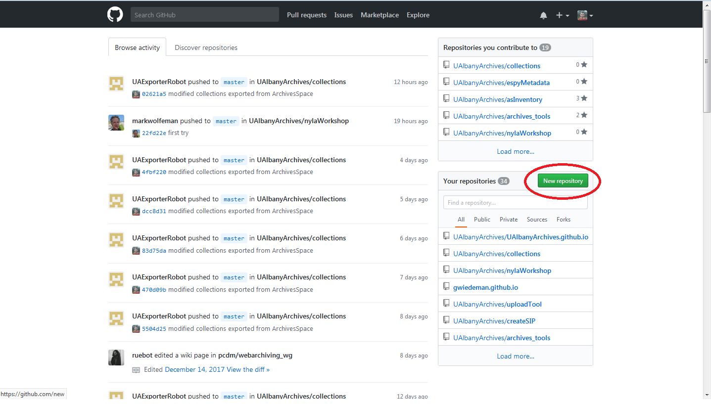

## Git and GitHub for Libraries

Greg Wiedeman and Mark Wolfe

M.E. Grenander Department of Special Collections & Archives

University at Albany, SUNY

---

1. [Create a Github Account](https://github.com/join?source=login) or [Login](https://github.com/login) to your existing account.

---

2. [Create a new git repository](https://github.com/new)

---

3. Enter USERNAME.github.io

---

4. This is your Github Repository

---

### CLI Path

5. [Download and Install Git](https://git-scm.com/)

---

### GUI Path

5. [Download and Install Github Desktop](https://desktop.github.com//)

---

### CLI Path

6. Clone your repo

* Open Terminal, Powershell or cmd.exe

		git clone http://github.com/USERNAME.github.io

* Change directory into your repo

		cd USERNAME.github.io

---

### GUI Path

6. Clone your repo

---

### CLI Path

7. Open your repo

* Windows:

		start .

* Mac OSX/Linux:

		open .

---

### GUI Path

7. Open your repo

---

8. Look at your repo

---

9. (Optional) Install a Markdown Editor

* Cross Platform:
	* [Atom](https://atom.io/)
	* [Typora](https://typora.io/)

* Windows:
	* [MarkdownPad 2](http://markdownpad.com/)

* Mac OSX/Linux
	* [Mou](http://25.io/mou/)
	* [MacDown](https://macdown.uranusjr.com/)

---

10. Edit README.md

